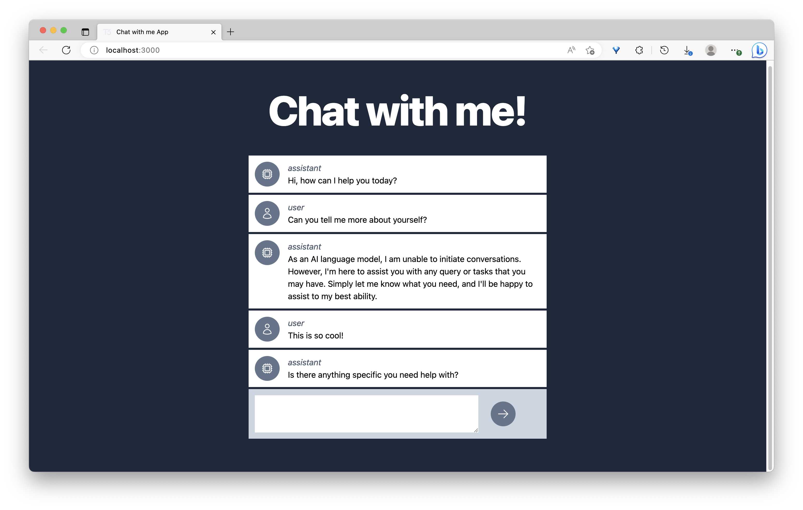

# Build Your Personal Chatbot!
In this workshop, we'll learn how to build a personalized chatbot powered by AI. During the session, we’ll cover:
- Building a conversational chatbot from scratch
- Deploying a T3 web app live for easy accessibility

This hands-on workshop is a fantastic opportunity to dive into the world of AI and chatbots while creating something truly special. [Live Demo](https://chat-gpt-demo-chinat.vercel.app/)

# Create T3 App

This uses the [T3 Stack](https://create.t3.gg/) project bootstrapped with `create-t3-app`.

## Getting Started with Your Personal AI Chatbot

We've made this project as simple as possible, so you can start with just the scaffolding we set up for you and add additional features later when necessary.

If you're not familiar with the different technologies used in this project, please refer to their respective documentation.

- [Next.js](https://nextjs.org)
- [Tailwind CSS](https://tailwindcss.com)
- [OpenAI](https://platform.openai.com/docs/introduction)

## Learn More

To learn more about the [T3 Stack](https://create.t3.gg/), take a look at the following resources:

- [Documentation](https://create.t3.gg/)
- [Learn the T3 Stack](https://create.t3.gg/en/faq#what-learning-resources-are-currently-available) — Check out these awesome tutorials

You can also visit the [create-t3-app GitHub repository](https://github.com/t3-oss/create-t3-app) — your feedback and contributions are welcome!

## Deploying Your Personal AI Chatbot

Follow our deployment guides for [Vercel](https://create.t3.gg/en/deployment/vercel), [Netlify](https://create.t3.gg/en/deployment/netlify), and [Docker](https://create.t3.gg/en/deployment/docker) for more information on how to deploy your AI chatbot. You will need to include your personal `NEXT_PUBLIC_OPEN_AI_API_KEY` API key in the deployment.
